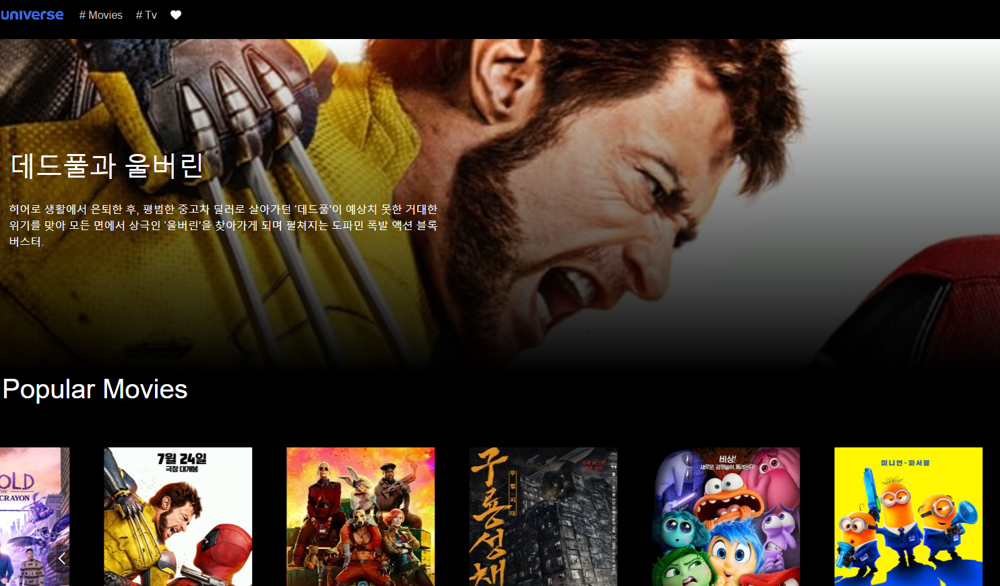

  <h1>🎬 Universe Movie APP! </h1>

<!-- Badges -->
<h4>
    <a href="https://univermovie.netlify.app">View Demo</a>
    <a href="https://velog.io/@hwn123h/Universe-%EC%98%81%ED%99%94-%EC%95%B1">Velog</a>
</h4>

TMDB API를 이용하여 영화, TV 시리즈의 정보를 제공

 

<!-- About the Project -->

## 💻 About the Project

이 프로젝트는 TMDB API를 활용하여 영화 및 TV 시리즈 정보를 검색, 저장, 관리할 수 있는 앱을 제작하는 데 목적이 있습니다.  
React와 Redux를 활용한 상태 관리, React Query를 통한 서버 데이터 캐싱, 무한 스크롤 등 다양한 기술을 학습하고 활용할 기회를 제공했습니다.

 
  

<!-- TechStack -->

### ⚡Tech Stack⚡

<ul>
   
   
   
   
   
   
</ul>

<!-- Features -->

### Features

- React-query를 이용한 서버 상태 관리
- Redux를 활용한 Wish List 전역 데이터 관리
- 무한 스크롤 기능을 통한 콘텐츠 탐색 (React Query의 `useInfiniteQuery` 사용)
- TMDB API로부터 영화/TV 정보를 동적으로 불러오기

## Acknowledgements

Use this section to mention useful resources and libraries that you have used in your projects.

- [Redux](https://ko.redux.js.org/introduction/getting-started/)
- [React Redux](https://react-redux.js.org/)
- [React Query](https://tanstack.com/query/latest/docs/framework/react/overview)
- [React Modal](https://github.com/reactjs/react-modal)
- [TMDB doc](https://developer.themoviedb.org/docs/getting-started)
